# ClawBack — Track, dispute, and recover retailer deductions.


A tool that helps analysts track, dispute, and recover retailer deductions — replacing messy spreadsheets with a clean workflow and real-time recovery metrics.

---

## How to Run

**Step 1.** Install [Node.js 20+](https://nodejs.org/) — pick your OS and download the installer.

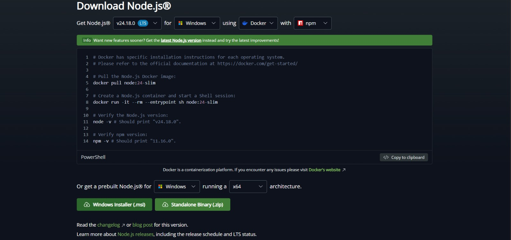
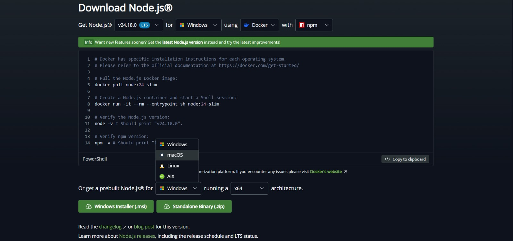

**Step 2.** Install [Docker Desktop](https://www.docker.com/products/docker-desktop/).

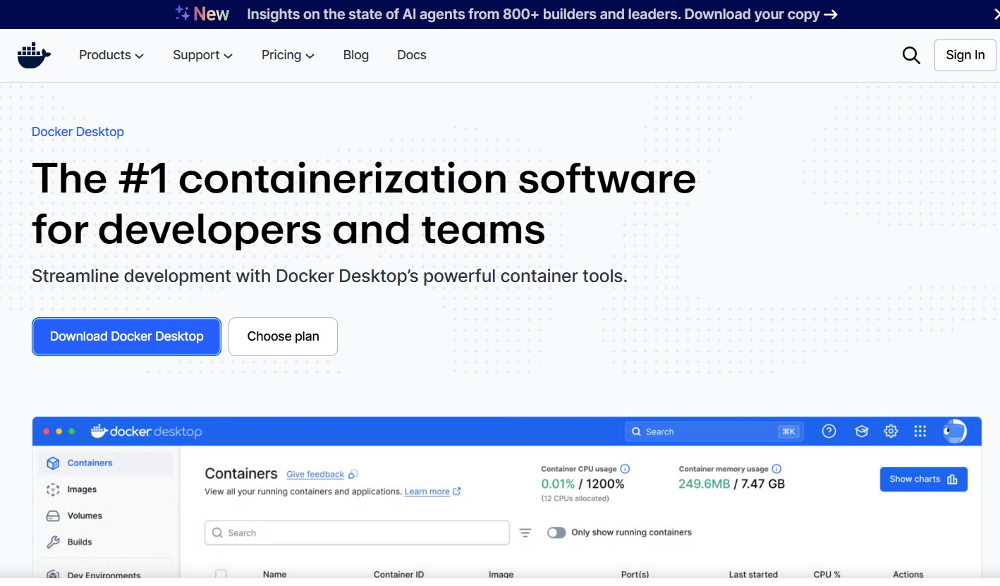

> **Windows users:** Open PowerShell as Administrator and run `wsl --install`, then restart your PC. Use the WSL terminal for all commands below.
>
> 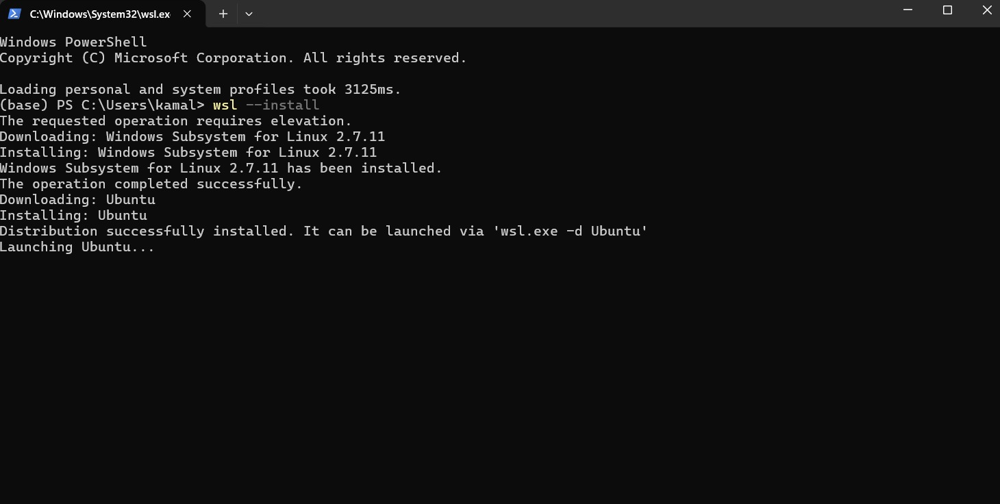
> 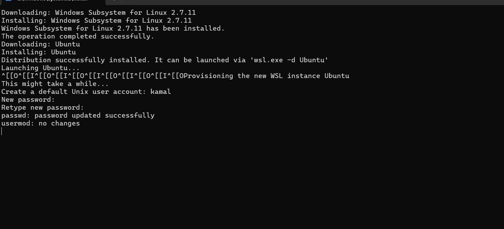

**Step 3.** Clone the repo and run the start script.

```bash
git clone https://github.com/KamalasankariS/ClawBack.git
cd ClawBack
./start.sh
```

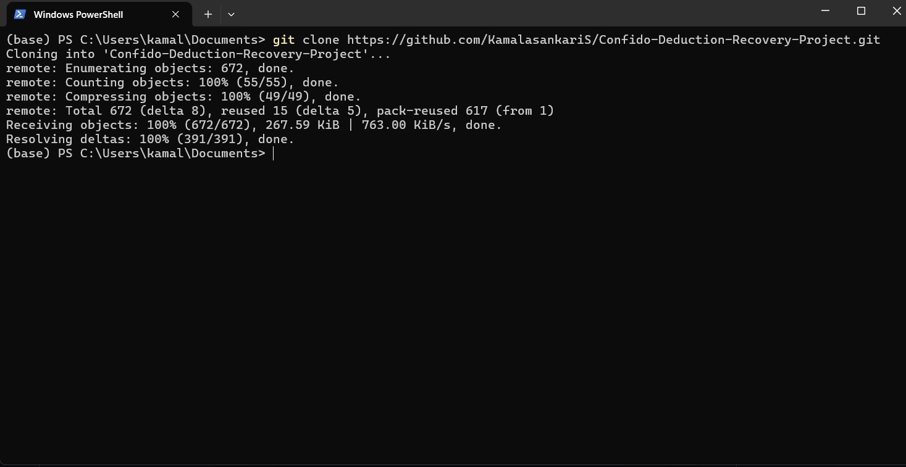

The script starts PostgreSQL, installs dependencies, seeds the data, and launches the app.

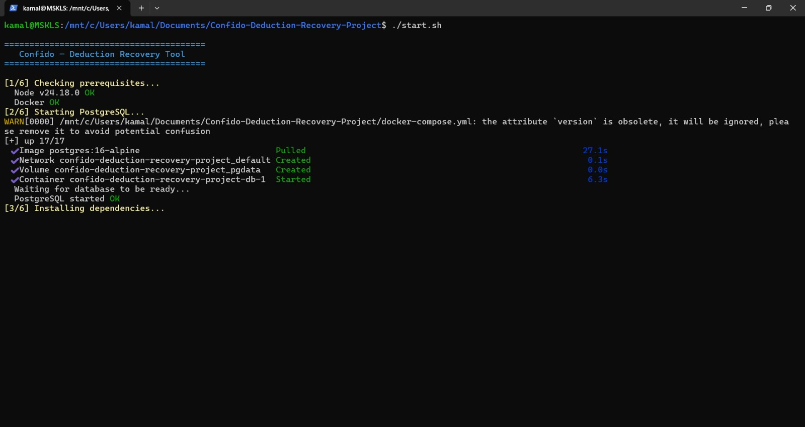
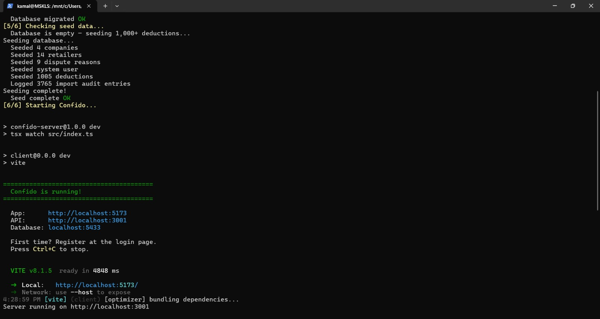

**Step 4.** The app opens at **http://localhost:5173**. Create your account with your name, employee ID, work email, and a password.

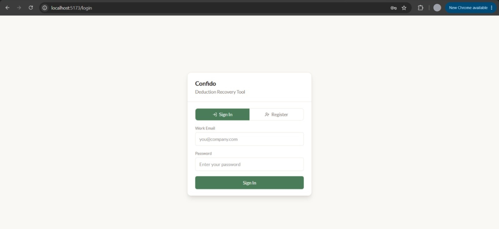

You're in! Here's what you'll see:

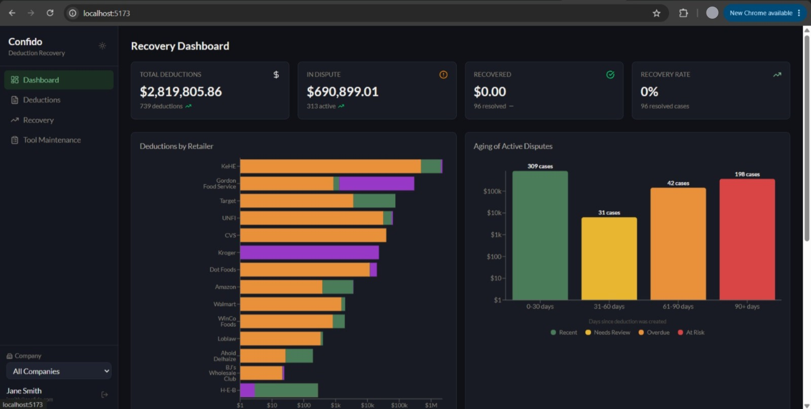
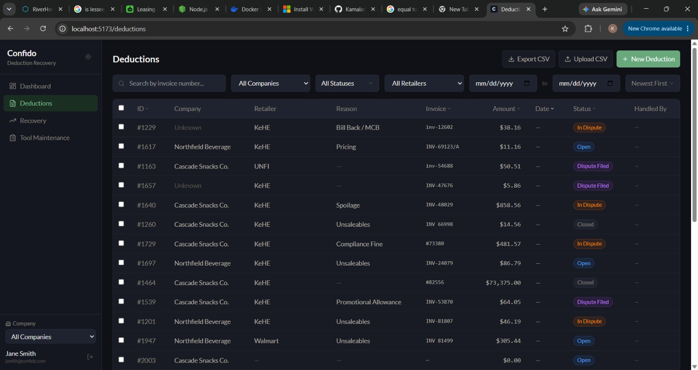
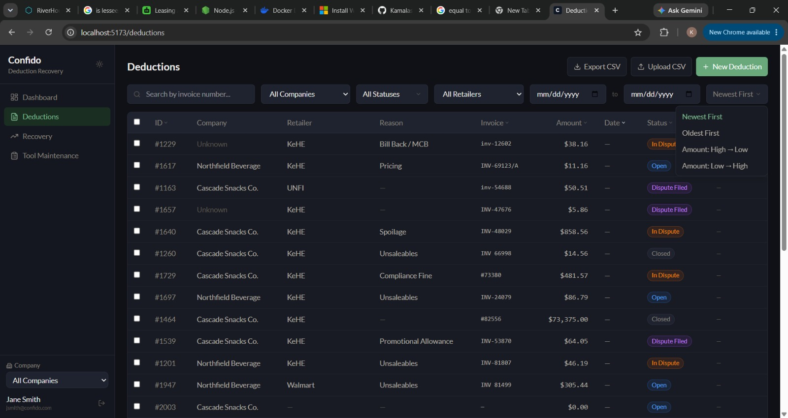
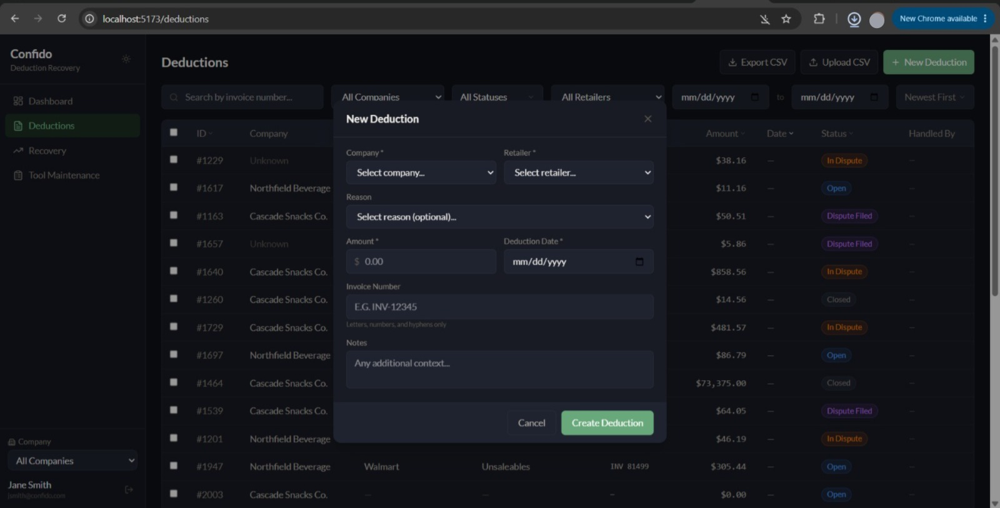

Press `Ctrl+C` to stop the app.

<details>
<summary>One-word setup (optional)</summary>

Add this alias to your `~/.zshrc` (or `~/.bash_profile`):

```bash
alias clawback='cd "/path/to/ClawBack" && ./start.sh'
```

Then just type `clawback` to launch.
</details>

<details>
<summary>Manual setup (if start.sh doesn't work)</summary>

```bash
# 1. Start the database
docker compose up -d

# 2. Set up the server
cd server && npm install && npx prisma migrate deploy

# 3. Seed the data (first time only)
npx tsx src/seed/seed.ts

# 4. Start the server (port 3001)
npm run dev

# 5. In a new terminal — start the frontend (port 5173)
cd client && npm install && npm run dev
```
</details>

---

## What You Can Do

- **Dashboard** — Recovery metrics, charts by retailer, aging of disputes, monthly trends
- **Deductions** — Browse, filter, sort, search, add manually or upload CSV
- **Triage** — Accept, Put on Hold, or Dispute each deduction (every action requires a note)
- **Dispute Pipeline** — File disputes, attach documents, record outcomes (Won / Partial / Lost)
- **Recovery** — Dedicated page with recovery rate breakdown and resolved/open case lists
- **Tool Maintenance** — Audit log of every data correction made during import

---

## Results

**Data Pipeline Performance** — The ETL pipeline ingests 1,007 raw financial records containing 57 retailer name variants, 7 date formats, 5+ amount formats, and 21 status labels. It normalizes everything into clean, canonical form while generating 4,664 audit log entries — an average of 4.6 traceable transformations per record, with zero data loss.

| Metric | Raw | Cleaned |
|--------|-----|---------|
| Retailer name variants | 57 | 14 canonical (4.1x reduction) |
| Date formats | 7 different formats | 1 (ISO Date) |
| Status labels | 21 variants | 4 canonical states |
| Amount formats | 5+ (currency, accounting, placeholders) | Numeric |
| Orphan foreign keys | 16% of records | Flagged in audit log |
| Soft-deleted records | 15% of records | Hidden from views, preserved in DB |
| Records requiring cleaning | 100% | All cleaned automatically |

---

## Assumptions

- **Authentication** — Analysts register with a work email, employee ID, name, and a strong password (8+ chars, uppercase, lowercase, number, special character). Sessions last 7 days. No SSO/OAuth.
- **No role-based permissions** — Any authenticated analyst can act on any deduction. Accountability comes from the mandatory audit trail, not access restrictions.
- **Mandatory notes** — Every workflow action (triage, dispute, resolve, close) requires the analyst to explain the decision. No untraceable changes.
- **Soft deletes** — 180+ records flagged as deleted in the raw data are imported but hidden from all views and metrics.
- **Orphan company IDs** — Raw records with company IDs that don't exist (0, 3) are imported with no company assigned and flagged in Tool Maintenance.
- **Recovery rate** — Calculated as: total recovered / total amount of resolved cases. Only resolved cases count — not all deductions.
- **Resolution logic** — "Won" = full amount recovered. "Partial" = analyst enters actual recovered amount. "Lost" = $0 recovered.

---

## Tradeoffs

| Decision | Why | Alternative considered |
|----------|-----|----------------------|
| **PostgreSQL over SQLite** | Proper types, concurrent access, scales with team | SQLite is simpler but limits concurrent writes |
| **JWT over SSO** | Sufficient for internal use, no external dependencies | SSO is better for enterprise but needs infrastructure |
| **Server-side pagination** | Handles dataset growth correctly | Client-side filtering works for 1K but breaks at 10K+ |
| **Hardcoded retailer alias map** | Reliable for known variants, zero false positives | Fuzzy matching risks false matches |
| **Controlled dropdowns** | Prevents data quality issues from free-text entry | Free text is flexible but causes inconsistencies |
| **CSV preview before import** | Analyst catches errors before they enter the system | Auto-import is faster but risks bad data |
| **Duplicate warning (not blocking)** | Sometimes legitimate duplicates exist | Hard-blocking is safer but creates false positives |

---

## What I'd Improve With More Time

- **Email/Slack alerts** — Notify when disputes hit aging thresholds (30, 60, 90 days)
- **Role-based access control** — Different permission levels (analyst, manager, admin)
- **SSO/OAuth** — Enterprise single sign-on with Google Workspace, Okta, etc.
- **Automated dispute suggestions** — Flag deductions where the reason is typically disputable and the amount exceeds a threshold

---

## Tech Stack

| Layer | Technology |
|-------|-----------|
| Backend | Node.js, Express, TypeScript, Prisma, PostgreSQL |
| Frontend | React, TypeScript, Vite, Tailwind CSS, Recharts |
| Auth | JWT with password policy enforcement |
| Testing | Vitest + Supertest (100 tests) |
| CI/CD | GitHub Actions |
